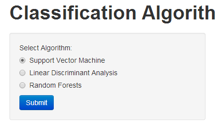
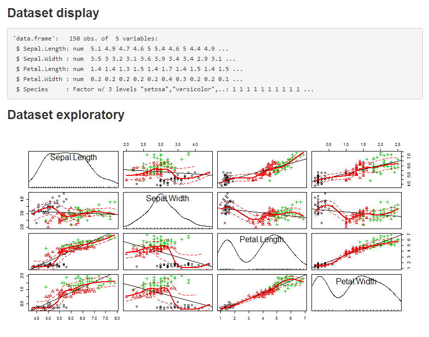
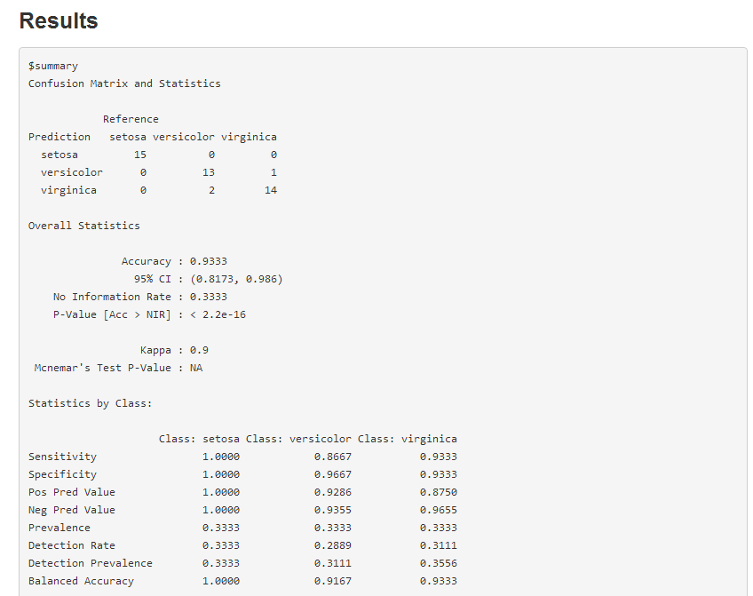

## Description

My application is a collection of classification algorithm. Including:

- Support Vector Machine

- Linear Discriminant Analysis

- Random Forests

--- .class #id 

## Getting Started Guide - 1

- Selecting the algorithm and Clicking on the "submit" button.

--- .class #id 

## Getting Started Guide - 2

- Dataset display and Dataset exploratory.

--- .class #id 

## Getting Started Guide - 3

- Analysis results.

